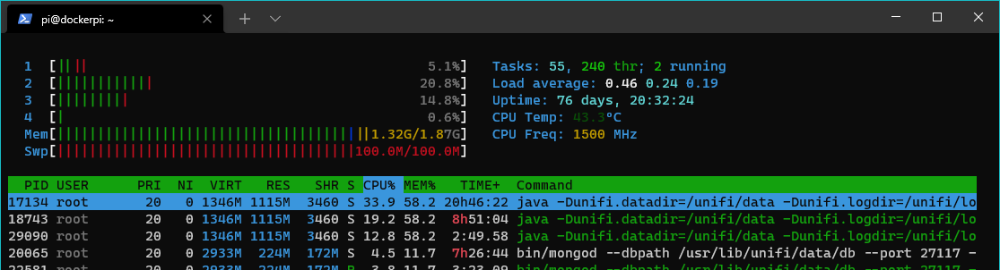

# Unifi + Pi-hole + OpenSpeedTest on RasPi using Docker

> This project is an operational git repository used to store my active docker-compose configuration running on a Raspberry Pi 4 (utilising a [PoE hat](https://www.raspberrypi.org/products/poe-hat/)) whilst also serving as a future reference and guide for anyone wanting to do something similar.

Project Components:
- [Docker](https://en.wikipedia.org/wiki/Docker_(software)) / [Docker Compose](https://docs.docker.com/compose/)
- [Unifi Controller](https://www.ui.com/download-software/) from [Ubiquiti](https://www.ui.com/)
- [Pi-hole](https://pi-hole.net/) Project
- [OpenSpeedTest™](http://openspeedtest.com/)

Dependencies:
- Official [Pi-hole](https://hub.docker.com/u/pihole/) project on Docker Hub
- Official [OpenSpeedTest](https://hub.docker.com/u/openspeedtest#!) project on Docker Hub
- Jcobalberty's great Unifi controller [docker/github project](https://github.com/jacobalberty/unifi-docker)
- Wbenny's cool temperature [fork](https://github.com/wbenny/htop#quick-installation-rpi) for htop

Useful Links / Further Reading:
- [Dropbox + Rclone auto-backup of unifi-controller](https://lazyadmin.nl/home-network/backup-unifi-controller-to-cloud/?unapproved=2920&moderation-hash=877022b0e9d44011245705e6e37a472f#comment-2920) from _lazyadmin.nl_
- [Cloudflare DNS (1.1.1.1)](https://blog.cloudflare.com/announcing-1111/)
- [Configure L2TP VPN in Unifi](https://vninja.net/2019/04/10/ubiquiti-usg-remote-user-vpn-using-l2tp/)
- [Generate a Secure PSK](https://cloud.google.com/network-connectivity/docs/vpn/how-to/generating-pre-shared-key) (Google)

## Configure Terminal/Bash Aliases
Open the bash_aliases file in Vim
```bash
vim ~/.bash_aliases
```
Append the following two lines and quit Vim saving the file
```bash
alias temp='/opt/vc/bin/vcgencmd measure_temp'
alias cls=clear
```

## Custom ```htop``` build with RasPi Temperature
Using [this github](https://github.com/wbenny/htop) project/fork of htop
```bash
cd ~
wget https://github.com/wbenny/htop/files/573914/htop_2.0.2-2_armhf.deb.zip
unzip htop_2.0.2-2_armhf.deb.zip
sudo dpkg -i htop_2.0.2-2_armhf.deb
rm -rf ~/.config/htop/htoprc
```


## Install _Docker_ and _Docker Compose_
```bash
# docker
curl -sSL https://get.docker.com | sh
sudo usermod -aG docker pi
sudo reboot
# docker-compose
sudo apt-get install -y libffi-dev libssl-dev
sudo apt-get install -y python3 python3-pip
sudo pip3 -v install docker-compose
```

## Change Pihole password
The Web interface password needs to be reset via the command line on your Pi-hole. This can be done locally or over SSH. You will use the pihole command to do this:
```bash
pihole -a -p
```
You will be prompted for the new password. If you enter an empty password, the password requirement will be removed from the web interface.

## Configure ```certbot``` for first-time use
Using the Linux terminal follow the steps using a DNS-based challenge mechanism
```bash
sudo certbot certonly --manual --preferred-challenges dns
```

## Manual Certificate Refresh (using ```certbot```)
Steps to follow to updated the unifi certificate, put it in correct docker compose folder, (re)pull the newest docker images and restart the services
```bash
# run certbot to get the new certificate
sudo certbot certonly --manual --update --preferred-challenges dns
# put yourself in the right directory
cd docker/unifi/cert/
# copy the new certificate files into the correct (docker-compose image) folder
sudo cp /etc/letsencrypt/live/unifi.bonner.uk/cert.pem .
sudo cp /etc/letsencrypt/live/unifi.bonner.uk/chain.pem .
sudo cp /etc/letsencrypt/live/unifi.bonner.uk/fullchain.pem .
sudo cp /etc/letsencrypt/live/unifi.bonner.uk/privkey.pem .
#put yourself in the right directory
cd ../..
# pull the latest docker images, stop the service and start it as a daemon
docker-compose pull
docker-compose down
docker-compose up -d --build
```

## Backup your Unifi Controller to Dropbox (using ```rclone```)
Using the Linux terminal, follow the process defined below
```bash
# install rclone
curl https://rclone.org/install.sh | sudo bash
# configure rclone
rclone configure
N
dropbox
9
enter key (client id = blank)
enter key (client secret = blank)
N
N
```
Now switch to Windows to complete the authorisation
```ps
# install rclone
choco install rclone -y
# authorise dropbox
rclone authorize dropbox
# web browser will open, follow the steps
# copy the authorisation code to he clipboard
```
Switching back to Linux, complete the setup and start the copy/clone
```bash
# paste the token
# finish and save the config
Y
# go configure a dropbox folder location online
# setup folder permissions on Linux for backup folder access by rclone
sudo usermod -a -G unifi pi
# setup a copy or clone from directory structure to dropbox directory
rclone copy /home/pi/docker/unifi/data/backup/ dropbox:Rclone/dropbox-raspi-unifi
```
Create a scheduled job to keep running the copy/clone
```bash
crontab -e
```
Append the following line to the crontab configuration (this launches with vim)
```cron
0 5 * * * rclone copy /home/pi/docker/unifi/data/backup/ dropbox:Rclone/dropbox-raspi-unifi
```